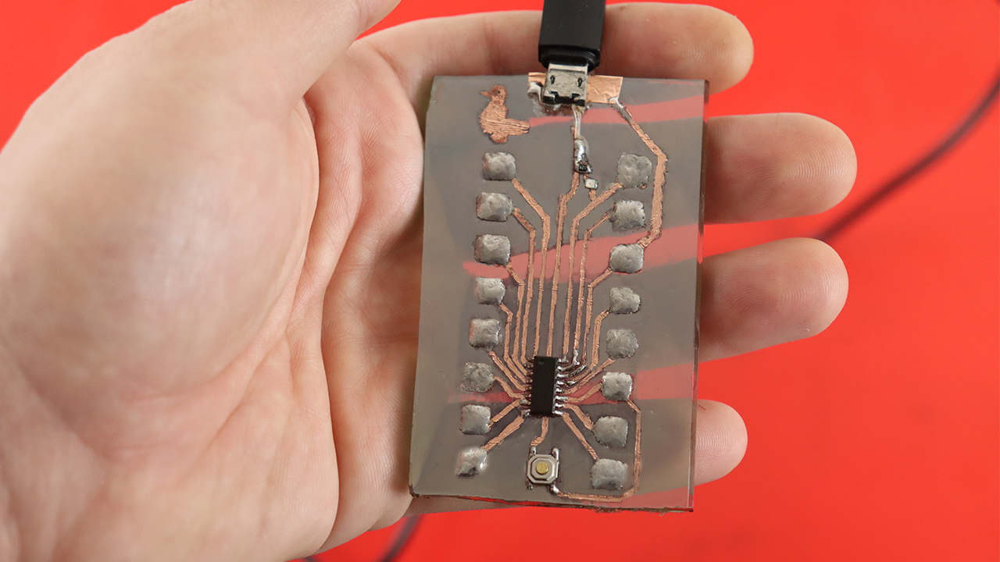

# Glass-PCB
Hardware files and blink code for the experimental Glass breakout board

This is the Kicad files for the glass breakout board which has famous "10 cent MCU". I used CH32V003AxMx version. To upload the firmware to the board, you need to install 'Mounriver studio'  from http://www.mounriver.com/ for free. Also you need to have one of their debuggers like this one: (https://s.click.aliexpress.com/e/_EwrcMk1)

You can also upload the code using arduino uno or esp board, but I have not tried that.

  
 

